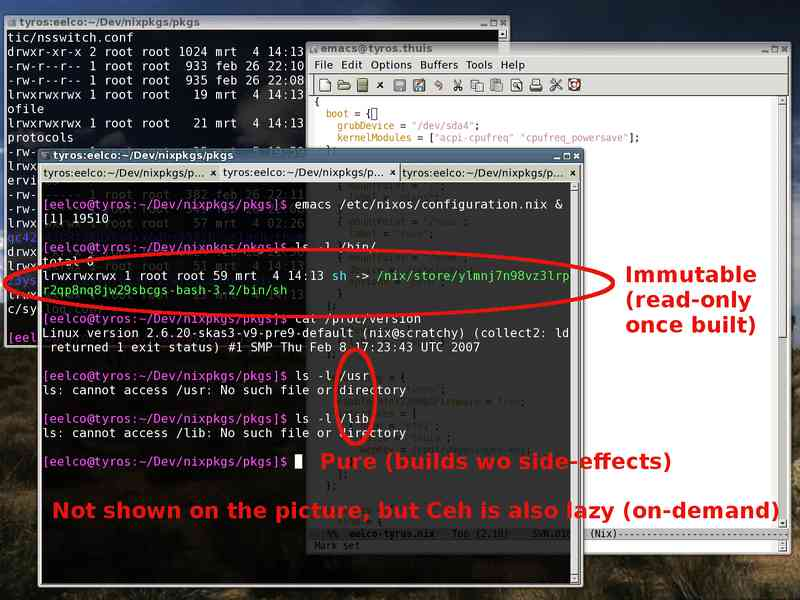
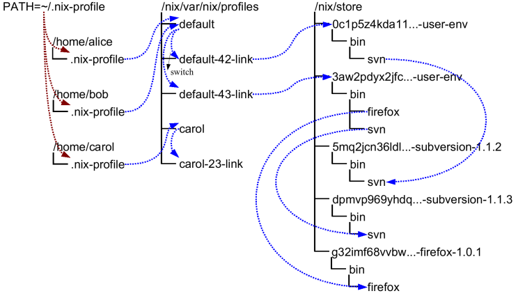

% Ceh - power user environments to share
% Gergely Risko (<gergely@risko.hu>)
% FP Afternoon in Zurich - August 29th, 2013

Agenda
======

- Nix terminology ([http://nixos.org/](http://nixos.org/))
    + Nix, the package manager and programming language
    + Nixpkgs, the package collection
    + NixOS, the operating system
- Ceh ([http://github.com/errge/ceh/](http://github.com/errge/ceh/))
    + the Git synchronized, sharable and reproducible power-user
      environment based on Nix and Nixpkgs
- Nix details.  Nix language example: vanitygen
- Ceh details.  Wrapper for tmux, ldd
- Haskell integration, included tools, deploying binaries
- Travis thyme
- Summary, what to do with this?

Nix, Nixpkgs, NixOS
===================

- Nix: a lazy and pure language to describe software build
  instructions (like debian/rules) and the corresponding package
  manager to execute these instructions (like dpkg, but more like
  Gentoo with binary cache).
   [https://github.com/NixOS/nix/](https://github.com/NixOS/nix/)

- Nixpkgs: a package collection with ~9000 packages.
   [https://github.com/NixOS/nixpkgs/](https://github.com/NixOS/nixpkgs/)

- Nixpkgs is continuously built using hydra.
   [http://hydra.nixos.org/](http://hydra.nixos.org/)

- NixOS: Linux distribution based on Nix.

NixOS screenshot 1/2
====================

NixOS grub menu, note the different configurations!  You can boot
the system at a specific version by just choosing from GRUB.

NixOS screenshot 2/2
====================

NixOS goals
===========

- Reliable, atomic upgrades and rollbacks,

- reproducible systems,

- buildable from source, but have a binary cache,

- consistency (e.g. security upgrades work even if you link statically
  against a library),

- package management even for non-root users.

Ceh goals
=========

- Reproducible distribution of packages (power-user envs):
    + GHC with batteries, best possible GHC experience,
    + Firefox with running Java, Flash and Google Hangouts,
    + fresh Emacs,
    + whatever else you want and help with it, :)
- upgrades/rollbacks via Git, synchronization via Github,
- on top of any modern GNU/Linux distro,
- on both i686 and amd64 machines,
- convenient (no chroots or VMs that you have to log into),
- /opt/ceh/home, /opt/ceh/p/myproject; we are single-user anyways.

Nix details
===========

- Store every installed package in a subdir inside /nix/store,
    + subdir name based on the hash of all the build inputs,
    + different versions/configurations of a package can be installed,
- hack the build environment and makefiles of packages to behave in
  /nix/store in a pure way: no random picking up of dependencies from
  /usr/lib or /usr/include, Nix is the language to describe this procedure
  (demo: [https://github.com/NixOS/nixpkgs/blob/master/pkgs/applications/misc/vanitygen/default.nix](https://github.com/NixOS/nixpkgs/blob/master/pkgs/applications/misc/vanitygen/default.nix))
- hack the installed binaries to have everything correctly RPATHed
  (demo: patchelf --print-rpath /nix/store/.../tmux and ldd),
- binary cache based on the output hashes,
- symlink farms (so called profiles) for a unixish view (next slide),
- can be used without NixOS.

Nix details
===========

Ceh details
===========

- Just a bunch of scripts to make handling of Nix convenient on a
  standard GNU/Linux workstation,
- root needed only for installation:

~~~~
sudo mkdir /opt/ceh /nix
sudo chown $USER. /opt/ceh /nix
chmod 0700 /opt/ceh /nix
cd /opt/ceh
git clone git://github.com/errge/ceh.git .
ln -s $HOME home
/opt/ceh/scripts/ceh-init.sh
~~~~
- single user, but we get /opt/ceh/home and /opt/ceh/p,
    + if you're really worried, look into LXC mount namespaces,
    + but don't hold onto your abstractions if you don't need them anymore,
- /opt/ceh/bin goes to your PATH and
  [/opt/ceh/bin/tmux](https://github.com/errge/ceh/blob/master/bin/tmux)
  installs tmux on-demand.

Haskell integration, included tools
===================================

- Since we use Haskell a lot, it's very well supported, full featured:
    + GHC in 32 and 64-bit mode,
    + with all the Platform libraries,
    + with a lot of extra libraries (e.g. lens, gtk, pipes),
    + everything built with profiling possibility,
    + hoogle with local data indexing for all the installed libraries,
    + ghc-vis and ghc-heapview,
    + ghc-mod for Emacs,
    + all coming from the Nix binary cache, so it's quick to install,

- documented way to compile 32 or 64-bit GHC (no more VMs).

Deploying compiled binaries
===========================
- Documented way to deploy Ceh compiled haskell binaries:
    + just gather the needed .so files from /nix/store,
    + put them in a lib/ directory,
    + use patchelf to redirect RPATHs to point there,
    + deploy binary+lib/ combination to any system even without Ceh.

~~~~
errge@curry:/tmp/deploy $ ldd ./PrefetchFS ; du -sh
  linux-gate.so.1 (0xf778a000)
  libfuse.so.2 => /tmp/deploy/./lib/libfuse.so.2 (0xf7754000)
  librt.so.1 => /tmp/deploy/./lib/librt.so.1 (0xf774c000)
  libutil.so.1 => /tmp/deploy/./lib/libutil.so.1 (0xf7747000)
  libdl.so.2 => /tmp/deploy/./lib/libdl.so.2 (0xf7743000)
  libgmp.so.10 => /tmp/deploy/./lib/libgmp.so.10 (0xf76c8000)
  libm.so.6 => /tmp/deploy/./lib/libm.so.6 (0xf768a000)
  libpthread.so.0 => /tmp/deploy/./lib/libpthread.so.0 (0xf7671000)
  libc.so.6 => /tmp/deploy/./lib/libc.so.6 (0xf74da000)
  /lib/ld-linux.so.2 (0xf778b000)
4.3M    .
~~~~

Travis thyme
============

[https://travis-ci.org/errge/thyme](https://travis-ci.org/errge/thyme)

.travis.yml, .travis.ceh:

~~~~
language: c
install: bash ./.travis.ceh
script: bash ./.travis.main
env:
  - CEH_GHC64=
  - CEH_GHC64=1
~~~~

~~~~
#!/bin/bash -e

sudo mkdir /opt/ceh /nix
sudo chown $USER. /opt/ceh /nix
chmod 0700 /opt/ceh /nix
cd /opt/ceh
git clone git://github.com/errge/ceh.git .
ln -s $HOME home
/opt/ceh/scripts/ceh-init.sh
~~~~

Travis thyme
============

[https://travis-ci.org/errge/thyme](https://travis-ci.org/errge/thyme)

.travis.main:

~~~~
#!/bin/bash -e

. /opt/ceh/scripts/ceh-profile.sh

cabal update
cabal install --only-dependencies
cabal configure --user --enable-tests
cabal build
cabal test
~~~~

Summary, where to go from here
==============================
So, how to use all this, where to go from here?

- Option 1, live with my governance regarding ceh and:
    + check out, install, try, periodically pull for new things,
    + send pull requests for missing stuff,
    + if I turn evil, just revert to a good state in Git and fork.

- Option 2, commercial setting or just a little bit paranoid:
    + fork me on Github,
    + and maintain your own version for your own company/whatever,
    + merge here and there.

- Option 3, meh, I'm not interested:
    + remember the novel, interesting way how Nix applied the concepts
      of purity, immutability, and lazyness to the software
      configuration world.

Thank you
=========

Questions, remarks?

I'm also available during the Zurihac to answer your questions or help
with installing/using/abusing Ceh.

[http://github.com/errge/ceh](http://github.com/errge/ceh)
